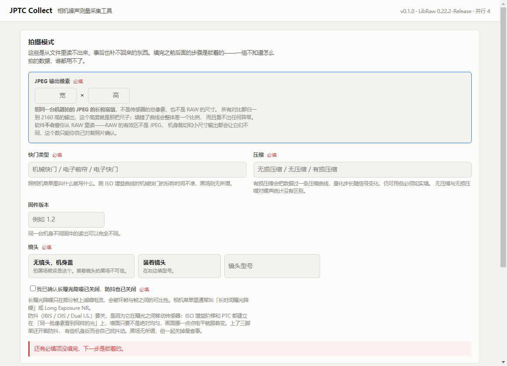
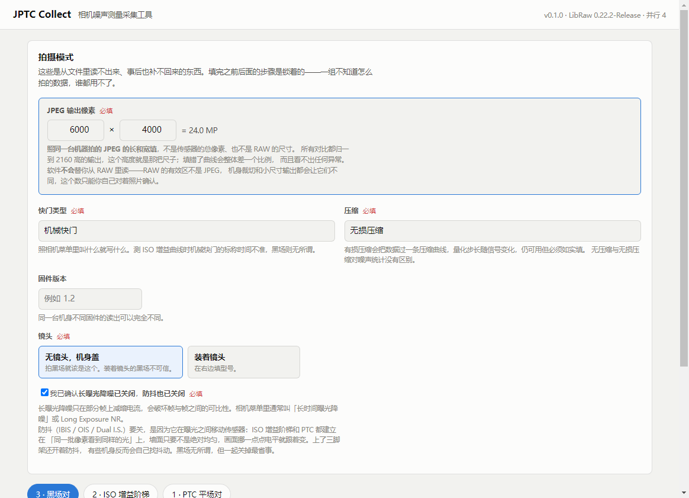
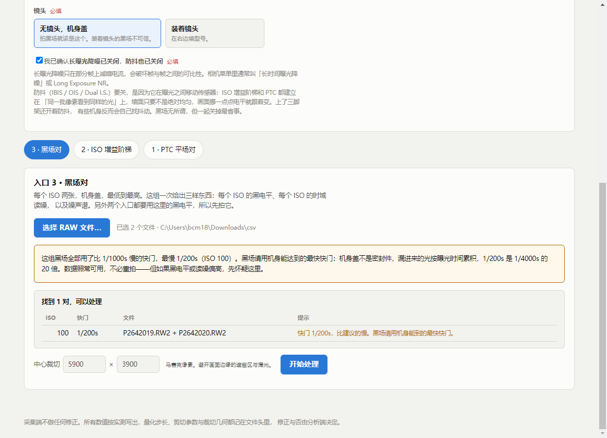
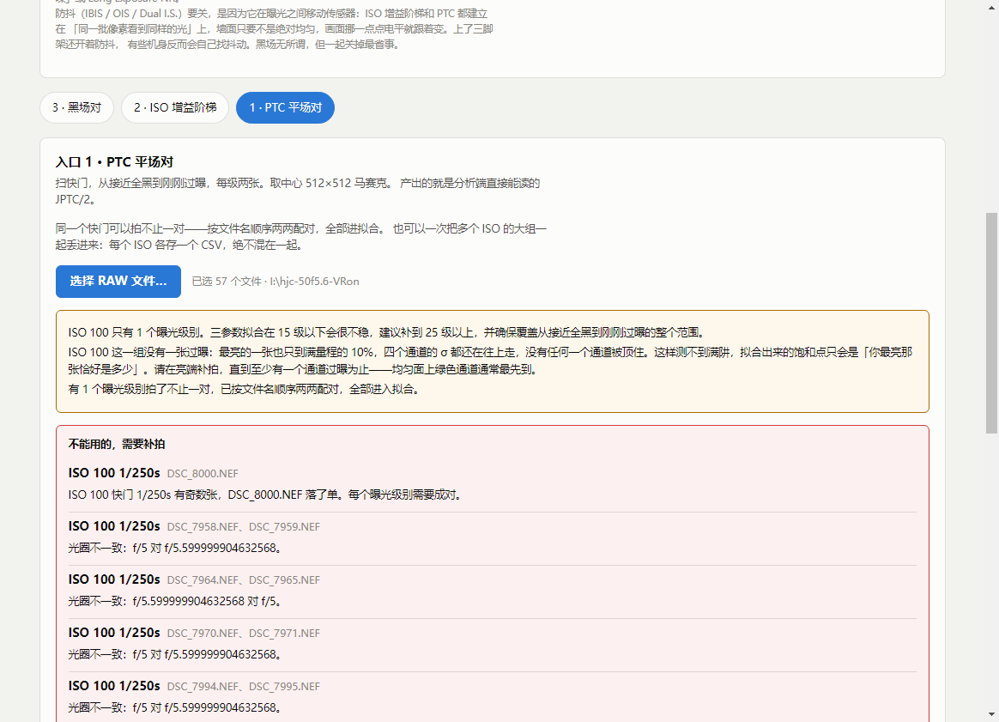
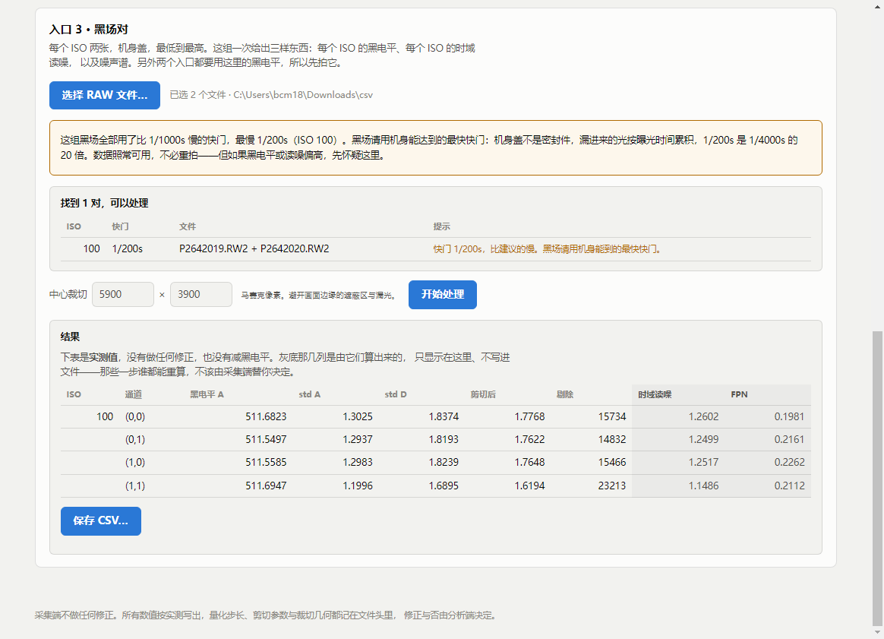
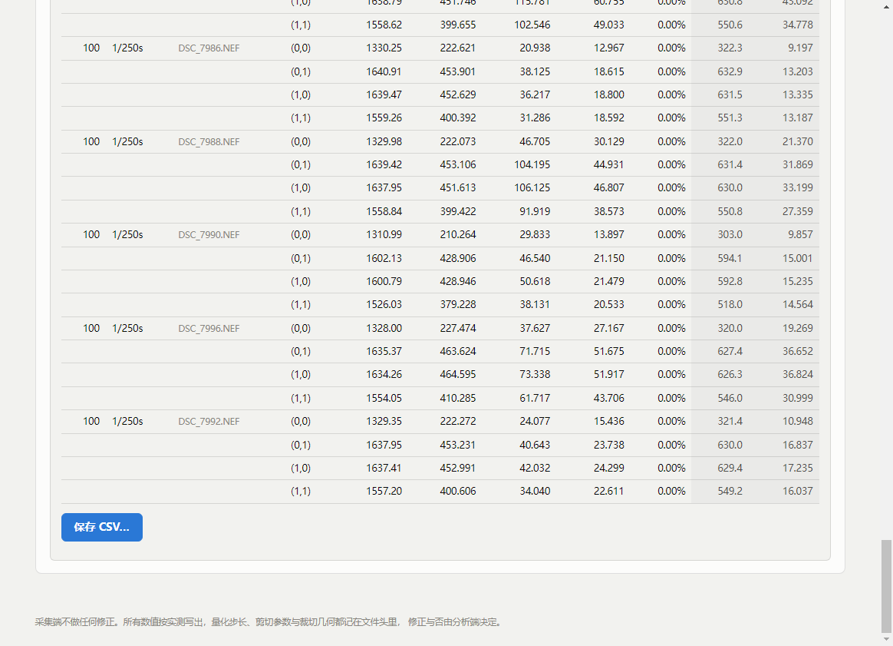
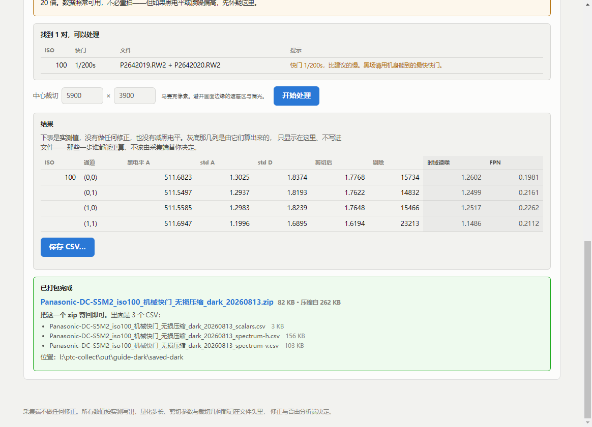
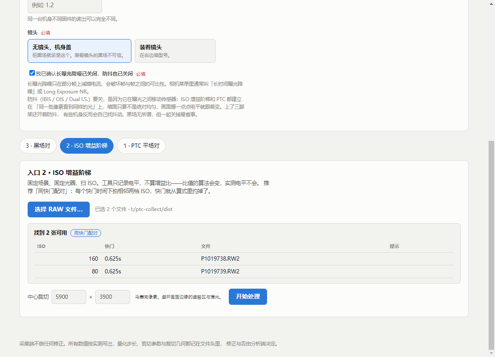

# JPTC Collect · 软件使用指南

这份讲**软件怎么用**。**怎么拍**在 [拍摄指南.md](拍摄指南.md) 里，两份配合看：先按拍摄指南拍完，再按这份处理。

软件全程**本地运行、不联网**。它读你的 RAW、算统计量、写出几个 CSV 打成一个 zip；照片本身不会离开你的电脑，你寄回的只有那个 zip。

---

## 安装

双击 `JPTC Collect Setup 0.1.0.exe`，一路下一步。Windows 64 位。

安装包没有代码签名，SmartScreen 可能会拦一下——点「更多信息」→「仍要运行」。

---

## 界面总览

打开是这样，上面是**拍摄模式**，下面三个标签页是三个**入口**：

后面全是锁着的，因为拍摄模式还没填完。

---

## 第一步：填拍摄模式

**这一步是硬门槛，填完之前后面点不动。**

里面的每一项都是**从文件里读不出来、事后也补不回来**的东西。一组不知道怎么拍的数据，谁都用不了。

| 字段 | 填什么 |
|---|---|
| **JPEG 输出像素** | 你这台机器拍出来的 **JPEG 的宽和高**。见下面的框 |
| 快门类型 | 相机菜单里叫什么就写什么：机械快门 / 电子前帘 / 电子快门 |
| 压缩 | 无损压缩 / 无压缩 / 有损压缩。有损也能测，但必须如实填 |
| 固件版本 | 选填。同机身不同固件的读出可以完全不同 |
| 镜头 | 拍黑场应该是「无镜头，机身盖」；装着镜头就填型号 |
| 长曝光降噪 + 防抖 | 一个勾，确认两个都关了 |

> **JPEG 输出像素为什么最重要**
>
> 所有机型的对比都归一到 **2160 高的输出**——同样的传感器噪声，出图越大、缩到 4K 时被平均掉的越多。这个高度就是那把尺子。
>
> 填错了，你这台机器的**整条曲线会差一个比例**，而曲线本身看不出任何毛病，事后也查不出来。
>
> 软件**不会**替你从 RAW 里读：RAW 有遮蔽区、机身裁切和小尺寸输出还会让两者更不一样。**对着你自己拍的 JPEG 确认一遍。**

快门类型和压缩是**手填**的，不是选择题——相机菜单里怎么写就怎么填，不用迁就任何固定说法。

---

## 第二步：选文件

选一个入口，点「**选择 RAW 文件…**」，把那一组的文件**全选**（Ctrl+A，或按住 Shift / Ctrl 挑）。

- 三个入口的照片放在**同一个文件夹**里没关系，按组选文件就行
- 拍废的那几张**不选进来**即可，不必移走
- 不是 RAW 的文件会被跳过并告诉你；不小心拖进来的文件夹会被展开

---

## 第三步：看软件说了什么

这是整个流程里**唯一需要你动脑**的地方。软件读完所有文件会自动配对，然后把问题分成三类：

**黄色框：提醒。**数据可用，但有事情你该知道。上图这组黑场用的是 1/200s，比建议的慢——机身盖不是密封件，漏进来的光按曝光时间累积。不必重拍，但万一读噪偏高，先怀疑这里。

**红色框：不能用，要补拍。**

**灰色框：找到几对、可以处理**，逐对列出 ISO、快门、文件名和提示。

下面这张是一组问题比较多的 PTC，三种提示都在：

常见提示对照：

| 提示 | 意思 | 怎么办 |
|---|---|---|
| ISO xxx 只有 1 张 / 有 3 张 | 这一档没成对 | 补拍，或把多的从选择里去掉 |
| 有奇数张，xxx 落了单 | 同一快门下多拍了一张 | 那一张会被单独退回，其余照常 |
| 光圈不一致 | 一对里两张的光圈不同 | 重拍这一对。**电子光圈每次收缩都有误差，优先手动光圈镜头** |
| 比黑电平高 xx DN | 漏光了，或根本不是黑场 | 检查机身盖，重拍 |
| 相隔 xx 分钟 | 两张隔太久，温度可能变了 | 能重拍就重拍；不能的话数据仍可用，这一档打个问号 |
| 快门比建议的慢 | 黑场没用最快快门 | 不拦你，但记住漏光按时间累积 |
| **没有一张过曝** | 亮端没拍够 | **见下** |
| 只有 N 个曝光级别 | PTC 的级别太少，拟合会不稳 | 补到 25 级以上 |

> **「没有一张过曝」是最容易被忽略的一条。**
>
> 没有过曝帧的 PTC 曲线**没有顶**：满阱测不到，拟合出来的「饱和点」只会是「你最亮那张恰好是多少」——而曲线本身看起来完全正常，拿到数据的人也发现不了。
>
> **一个通道过曝就够了。**对着均匀白面，绿色通道总是最先到顶；等红蓝也过曝，中间已经浪费了一大截量程。
>
> 软件用两个判据：过曝像素的比例，以及**某个通道的 σ 塌回去**（被顶住的通道没有噪声可言）。后者不依赖相机标称的最大值，所以标称值不准也照样能认出来。

---

## 第四步：处理

「中心裁切」保持默认即可——它是为了避开画面边缘的遮蔽区和可能的漏光。黑场和增益默认取中心 5900×3900 马赛克像素，PTC 取中心 512×512。

点「**开始处理**」。速度取决于机器，一对大约十秒，并行度是你逻辑核数的一半。

表格分两块：

- **白底 = 实测值**，会写进文件。没有做任何修正，也没有减黑电平
- **灰底 = 推算值**，只显示在这里、**不写进文件**——那一步谁都能重算，不该由采集端替你决定

一眼看健康不健康：

- 同一 ISO 下，**两个绿色通道的数字应该几乎相同**
- `黑电平 A` 和 `黑电平 B` 应该很接近（差不到 0.1）
- 随 ISO 升高，`时域读噪`（DN）应该单调变化，**不该跳来跳去**

PTC 的结果表长这样，一行一个曝光级别：

---

## 第五步：保存并寄回

点「**保存 CSV…**」，选一个文件夹。软件会把这一组的所有 CSV **打成一个 zip**。

**把这一个 zip 寄回即可**，不用管里面有几个文件。

一整套黑场（28 档 ISO）的 CSV 加起来约 6 MB，压成 zip 之后约 **2 MB**——都是数字文本，压得很狠，邮件附件就能发。

---

## 三个入口的区别

| | 入口 3 · 黑场对 | 入口 2 · ISO 增益阶梯 | 入口 1 · PTC 平场对 |
|---|---|---|---|
| 拍什么 | 机身盖，每 ISO 两张 | 固定场景扫 ISO | 单/多 ISO，扫快门，每级两张 |
| 产出 | 黑电平、时域读噪、噪声谱 | 各档 ISO 的电平 | 完整噪声模型的原料 |
| 文件数 | 3 个 CSV | 1 个 CSV | 每个 ISO 一个 CSV |
| 张数 | 40–56 | 约 20 | 50–60 |

**顺序**：拍的时候先拍黑场（机身盖、冷机的时候最方便），但**软件这边三个入口谁先谁后都行**——每一组只记它自己量到的东西，不做任何跨组计算。比如 PTC 表里不写黑电平，那是黑场组量到的，两份表一起寄回来、拼起来是分析端的事。

### 入口 2 的两种拍法

软件会自己认出你用的是哪一种，并在标签上标出来：

- **同快门配对**：同一个快门下拍相邻两档 ISO。快门在算式里被约掉，**不吃快门标称值的准确度**
- **自动快门扫 ISO**：一档 ISO 一张，快。但依赖 RAW 里记的**标称**快门时间，而机械快门的实际值与标称有系统性偏差
- **两种都有**：也会如实标出来，两条链分别记录

漏了某一档 ISO 也不用重拍整组：补一张**同快门**的、和它相邻的已有 ISO 各一张，两张就能把它接回阶梯上。

### 入口 1 可以省事的两件事

- **同一个快门可以拍不止一对**，按文件名顺序两两配对，全部进拟合。但注意这**不增加曝光级别**——同一快门拍二十对是一个点量了二十次
- **多个 ISO 可以一次丢进来**，每个 ISO 各存一个 CSV，绝不混在一起

---

## 常见问题

**软件会联网吗？**
不会。全程本地，照片不离开你的电脑。

**它会改我的 RAW 吗？**
不会。只读。

**处理到一半关掉会怎样？**
什么都不会留下，重新来一遍就是。

**「采集端不做任何修正」是什么意思？**
写进文件的每一个数都是原始实测值：不除 √2、不做 Sheppard 修正、不减黑电平。量化步长、剪切参数、裁切几何都记在文件头里。要不要修正、怎么修正，由拿到数据的人决定——这样同一份数据以后换个算法还能重算。

唯一不可逆的一步是**坏点剪切**（k=3.5），因为它要逐像素判断、事后复现不了。所以它的全部输入都记下来了：k 值、未剪切的原值、被剔除的像素数。剪切不可撤销，但可审计。

**有什么不对劲怎么办？**
任何一步觉得奇怪、软件报了看不懂的错、或者你的机器有什么特殊情况（没有电子快门、ISO 档位不是整档、RAW 是有损压缩且关不掉）——**直接问，不要自己想办法绕过去**。绕过去的数据看起来是好的，但用起来是错的，而且事后查不出来。
