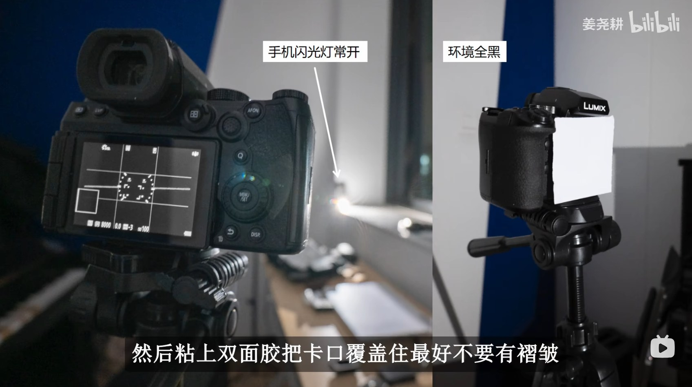

# 相机噪声测量 · 拍摄指南

感谢你愿意帮忙测一台机器。

这份数据最后会进入一个跨机型的噪声与动态范围对比库。它有用的前提是**每台机器都按同样的方式测**——所以流程里有些看起来啰嗦的要求，下面都写了原因。你觉得哪条不合理，告诉我，别自己改。

需要的东西：相机、机身盖、一支镜头（只有第二组要用）、三脚架、一面墙、一台 Windows 电脑。第三组还要：**一张白色半透明片**（描图纸、乳白亚克力、白色塑料袋剪一块都行）、**双面胶**、**一部带手电筒的手机**。**不需要**测试图卡、不需要灯箱。

还需要一个数字：**你这台机器拍出来的 JPEG 有多少像素（宽 × 高）**。软件第一栏就问它，而且它是整套数据里最要紧的一个数——理由在下面「用软件处理」那一节。相机说明书里的「记录像素数」，或者随便拿一张 JPEG 看属性都行。

三组拍摄，加起来大约 **200 张照片**。

---

## 先做这件事：相机设置

这几项设错了，拍多少都白费。

| 设置 | 要求 | 为什么 |
|---|---|---|
| **ISO 增量** | **设成 1/3 EV**（菜单里叫「ISO 感光度增量」「ISO 步长」） | 第一、二组都要按机身**最小细分档**逐档走。设成 1 EV 的话你只能拍到整档，中间三分之二的曲线就没有了，而且事后补不上——补拍的那几张温度和电池状态都变了 |
| **快门增量** | **设成 1/3 EV** | 第三组按 2/3 EV 一级扫，需要 1/3 档的刻度才走得准 |
| **无镜头释放快门** | **打开**（菜单里叫「无镜头拍摄」「Release w/o Lens」） | 第一、三组都是摘掉镜头拍的。这个开关默认常常是关的，到时候按下去没反应 |
| **长曝光降噪** | **必须关闭** | 它只在部分帧上减暗电流，会破坏帧与帧之间的可比性。菜单里通常叫「长时间曝光降噪」或 Long Exposure NR |
| **防抖** | **必须关闭** | IBIS / OIS / Dual I.S. 都算。它在曝光之间移动传感器，而 ISO 增益阶梯和 PTC 都建立在「同一批像素看到同样的光」上；墙面只要不是绝对均匀，画面挪一点电平就跟着变。上了三脚架还开着防抖，有些机身反而会自己找抖动 |
| 格式 | RAW，**无损压缩**或无压缩 | 有损压缩也能测，但必须在软件里如实填写，否则数据会被误读 |
| 高感降噪 | 随意，但记下设置 | 多数机器不动 RAW，少数会 |
| 白平衡、照片风格、HDR、多重曝光 | 随意 / 关闭 | 不影响 RAW，但关掉省心 |
| 自动亮度优化 / DRO / iDR | **关闭** | 有些机器会改 RAW 的曝光 |
| 图像尺寸 | **最大（L / 全画幅输出）**，并记下它是多少像素 | 归一化用的就是这个尺寸；中途改尺寸会让数据前后不可比 |

**如果你的机器有电子快门，第二组请用电子快门。**原因在那一节里说。

---

## 第一组 · 黑场（先拍这个）

**为什么先拍**：这组给出每个 ISO 的黑电平，后面两组都要减它。没有它，后面的数据算不出来。

### 怎么拍

1. **摘掉镜头，盖上机身盖。**再套一层：把相机塞进相机包、或者拿衣服盖住，关灯。
   
   > 机身盖不一定完全不透光，卡口缝隙也可能漏。多包一层几乎不花时间，但漏光会让整组数据作废，而且从数字上不一定看得出来。

2. 快门速度：**用你的机器能达到的最快快门**（通常 1/4000 或 1/8000）。光圈随意（没有镜头就没有光圈）。

   > 主要不是为了暗电流——那点时间里暗电流只有百分之一个电子。是**漏光**。机身盖不是密封件，
   > 卡口也不是，漏进来的光按曝光时间累积：1/200s 是 1/4000s 的 20 倍。
   > 而漏光最麻烦的地方在于，它看起来就是一个普普通通的噪声底。
   >
   > 软件会检查这一项，慢了会**着重提示**，但**不会拦你**：盖子真的不透光的话，多快都一样。
   > 已经拍成慢快门的不用重拍，只是万一黑电平或读噪偏高，先从这里查。

3. 从**最低 ISO 拍到最高 ISO**，按机身的**最小细分档**一档不落，每一档 **连拍两张**。

   - **1/3 档全测**，不要只拍整档：100、125、160、200、250、320、400、500、640、800…一直到最高
   - 如果你的机器有扩展 ISO（L、H 之类），一并拍上，标出来
   - **两张必须连着拍**，中间不要停

   > **为什么不能只拍整档。**厂商的 1/3 档不都是同一回事：有的是模拟增益真的变了，有的只是把整档的数据乘一个系数（所谓「假 ISO」），还有的机器在某一档上切换双原生增益。只拍整档，这些台阶恰好全部落在采样点之间，曲线看起来光滑，而真实的跳变一个都没测到。
   >
   > 两张连拍则是因为这套方法靠两帧相减来分离噪声。中间隔太久，传感器温度变了，两张就不再可比。

4. 拍完检查一下：**每个 ISO 恰好两张**，不多不少。多出来的删掉。

1/3 档从 100 到 25600 是 25 档，到 102400 是 34 档。**大约 25–35 档 × 2 张 = 50–70 张。**

### 常见错误

- ❌ 一个 ISO 拍了三张（软件会拒绝，让你删到两张）
- ❌ 忘了关长曝光降噪
- ❌ 机身盖没盖严，或者在亮处拍的
- ❌ 中途换了压缩设置

---

## 第二组 · ISO 增益阶梯

**测什么**：各档 ISO 之间增益的比值。这条曲线配上第三组，就能把读噪换算成电子数。

### 怎么拍

1. **把相机固定住。**三脚架最好，压在桌上、靠在墙上都行，只要**从头到尾不动**。

2. 装一支镜头，**对准一面均匀的墙**。
   
   - 墙上有纹理没关系，我们只用画面的平均亮度
   - **不要有阳光斑、灯的高光、窗户**——画面里不能有过曝的地方
   - **光源要稳定**：日光（阴天最好）或直流供电的灯。**普通市电 LED 和荧光灯在高速快门下会闪**，那会让电平乱跳

3. **固定光圈**，整组不许变。
   
   > 优先用带光圈环的手动镜头。电子光圈每次曝光都重新收缩，有微小的重复性误差，会直接进入结果。

4. **优先用电子快门。**
   
   > 不是因为机械快门抖，而是因为 RAW 里记的是**标称**快门时间。机械快门的实际时间与标称值有系统性偏差，而这个偏差读不出来。电子快门的曝光时间由时钟决定，标称就是实际。
   >
   > 没有电子快门也能拍，下面的「配对法」正是为了绕开这个问题。

### 两种拍法，任选其一（都拍最好）

**A. 配对法（推荐，对快门精度不敏感）**

和黑场一样，**这里也要按最小细分档逐档走，不许大跳**——理由同上，1/3 档上藏着真增益变化和「假 ISO」的分界。

但不必一档一对。**同一个快门下连拍 4 档 1/3 ISO**（合计正好 1 档亮度），然后快门降一档，**从上一组的最后一档接着拍**：

```
1/500s  →  ISO 100, 125, 160, 200
1/250s  →  ISO 200, 250, 320, 400      ← 200 与上一组重叠，链就接上了
1/125s  →  ISO 400, 500, 640, 800
1/60s   →  ISO 800, 1000, 1250, 1600
…一直到最高 ISO
```

同一组里只要快门**相同**就行，准不准无所谓——它在计算里被约掉了。快门减半正好抵消 ISO 涨的那一档，所以每组的画面亮度都回到同一个位置。重叠的那一档是把两组焊在一起的焊点，**不能省**。

选快门时让每组**最低 ISO 那张欠曝约一档**，这样组内最高的那张也还没过曝。

25–34 档、每组 4 张、每组净增 3 档 → **约 32–45 张**。

**B. 自动快门法（快，但吃快门精度）**

光圈固定，快门放自动挡，从最低 ISO 一路拍到最高，**同样每个 1/3 档一张**。

约 25–34 档 → **25–34 张**。

> 两种都拍的话，软件会把两条曲线画在一起。**它们分歧的地方就是你这台机器快门标称值不准的地方**——这本身也是有用的信息。

### 常见错误

- ❌ 中途碰到了相机或改了光圈
- ❌ 画面里有过曝的高光
- ❌ 用市电 LED 灯（高速快门下电平会乱跳）
- ❌ 拍了一半光线变了（云飘过来）

---

## 第三组 · PTC 平场对

**测什么**：单个 ISO 下的完整噪声模型——读噪、增益、像素响应不均匀性、满阱。

**测哪几档 ISO**（按重要性排，能多测自然更好）：

1. **最低原生 ISO**
2. **第二个原生 ISO** —— 双原生增益机器的高档那一个（松下 S5II / S1RII 是 640，很多机器在 400–800 之间）。那里是增益切换点，噪声模型在那一档整个换一副样子，只测 base ISO 是看不到的。说明书里查「双原生 ISO」；实在查不到就跳过这一档，在软件里说明一下
3. **ISO 3200** —— 跨机型对比用的公共参照点

### 怎么搭这个平场



*左：手机手电筒常亮当唯一光源，环境全黑。右：白片用双面胶贴住卡口，盖严、不留缝、尽量不起褶皱。*

**摘掉镜头**，用一张白色半透明片贴住卡口：

- 描图纸、乳白亚克力薄片、白色塑料袋剪一块，都可以
- **双面胶把整个卡口盖严，不能有缝**——没有镜头，卡口就是唯一的入光口，漏一条缝进来的就是直射光，不是均匀光
- **尽量别有褶皱。**褶皱不会成像（没有镜头就没有成像），但它改变局部透过率，会在画面上留下一层缓慢起伏的阴影
- **环境全黑**：关灯、拉窗帘。屋里任何别的光源都会从别的角度打上来，破坏均匀性
- **光源用手机手电筒，常亮**（不是闪光，是常开的那个模式），架在扩散片前方一段距离，正对着照

> **为什么这样比对着白墙好。**没有镜头就没有渐晕、没有对焦、没有光圈——一整类不均匀性和「电子光圈每次收缩都有误差」的问题直接消失了。传感器上每个像素看到的是扩散片的一大片，天然就是平的。
>
> 手机手电筒是**电池直流供电**，不像市电 LED 和荧光灯那样按 50/100 Hz 闪——高速快门下市电灯的电平会乱跳，而这一组的整个量程就是靠改快门扫出来的。**手机要开到最亮**（有些手机低亮度档用 PWM 调光，那又闪回去了），**关掉自动锁屏**，中途不要碰它。

### 怎么拍

1. ISO 固定在要测的那一档。M 档。没有镜头就没有光圈可设，这一项不用管了。

2. **从过曝一路扫到噪声底**，靠改快门覆盖整个范围：

   - **每 2 个 1/3 档快门一个曝光级别**（也就是每级差 2/3 EV），拨盘拨两下拍一次
   - 每个级别**连拍两张**
   - 亮端从**确实过曝**开始，暗端拍到**接近全黑**为止

   ```
   过曝端  1/13  1/20  1/30  1/50  1/80  1/125 …
                 ↑ 每次拨两下（2/3 EV）
   ```

   12 EV 左右的量程 → **约 18 级 × 2 张 = 36 张**，三档 ISO 合计 **约 110 张**。

   > **每 2 档而不是每档**，是为了省快门：1/3 档逐档扫是 54 级 108 张，一台机器三档 ISO 就是 300 多次快门。2/3 EV 的间距仍然给出 18 个级别，三参数拟合够用了。

   > **亮端只要有一个通道过曝就够了。**绿色通道总是最先到顶；等到红蓝也过曝，中间已经浪费了一大截量程。
   > 软件会检查这件事：**一组里如果一张都没过曝，会明确提示**——四个通道的 σ 还在往上走，说明谁都没被顶住。
   > 这种情况下测不到满阱，拟合出来的「饱和点」只会是「你最亮那张恰好是多少」，而曲线本身看着完全正常。

### 两件省事的事

**同一档快门可以多拍几对。**不必刚好两张。软件按**文件名顺序**两两配对（1+2、3+4…），
每一对都是一个独立的测量，全都进拟合。奇数张的话，落单的那张会被单独挑出来告诉你，
前面的对不受影响。

> 注意这不会增加曝光级别。同一快门拍二十对，是**一个点量了二十次**，不是二十个点；
> 拟合要的是级别数，软件的「级别太少」提醒也是按级别数算的，不会因为你多拍就不提醒。

**多个 ISO 可以一次丢进来。**不用一档一档跑。软件按 (ISO, 快门) 分桶，
每个 ISO 是一条**独立的曲线**，各自存成一个 CSV（`…_ptc_iso100.csv`、`…_ptc_iso640.csv`），
绝不会混在一张表里——增益正是这条曲线要测的东西，跨 ISO 混起来就没意义了。
级别太少的提醒也是**逐 ISO** 给的，一档拍得足不会替另一档遮掩。

### 常见错误

- ❌ 卡口没盖严，有一条缝在漏直射光
- ❌ 屋里没全黑（显示器、指示灯、门缝都算）
- ❌ 手机自动锁屏，扫到一半灯灭了
- ❌ 手机手电筒不是最亮档，PWM 调光又闪回去了
- ❌ 曝光级别太少（少于 15 级，拟合会不稳）
- ❌ 最亮的那几张其实没过曝（那样测不到满阱）

---

## 用软件处理

> 这一节是简版。带界面截图的完整版在 [使用指南.md](使用指南.md)。

1. 打开 **JPTC Collect**。

2. **先填「拍摄模式」。**填完之前后面是锁着的。
   
   这些字段从文件里读不出来、事后也补不回来：快门类型、压缩方式、有没有装镜头、长曝光降噪是否关闭。**一组不知道怎么拍的数据，谁都用不了**，所以这里是硬门槛。

   快门类型和压缩是**手填**的——相机菜单里叫什么就写什么，不用迁就任何固定说法。

   **第一栏「JPEG 输出像素」最重要。**填你这台机器拍出来的 **JPEG 的宽和高**（例如 6000 × 4000），
   不是传感器标称的总像素、也不是 RAW 的尺寸。

   > 为什么：所有机型的对比都归一到 **2160 高的输出**——同样的传感器噪声，出图越大、缩到 4K 时被平均掉的越多。
   > 这个高度就是那把尺子。填错了，你这台机器的整条曲线会**整体差一个比例**，而且曲线本身看不出任何毛病，
   > 事后也查不出来。
   >
   > RAW 的尺寸不能拿来代替：传感器四周有遮蔽区，那部分不进照片；机身裁切、小尺寸输出还会让两者差更多。
   > 所以软件**不提供**「从 RAW 读一个填进去」——那种按钮一定会被顺手点掉，于是一个没人看过的错数就进来了。
   > 这个数只能你对着自己的照片确认。填完之后如果和读到的 RAW 有效区差得多，软件会提醒你再核一遍。

3. 选一个入口，点「选择 RAW 文件…」，**把那一组的文件全选上**（Ctrl+A 全选，或按住 Shift / Ctrl 挑）。

   三个入口的照片放在同一个文件夹里也没关系——按组选文件就行，不用先分成三个文件夹。
   拍废的那几张不选进来就是了，不必移走。

4. 软件会读一遍选中的文件并**自动配对**，然后告诉你哪些能用、哪些不行。
   
   常见提示：
   
   | 提示 | 意思 | 怎么办 |
   |---|---|---|
   | ISO xxx 只有 1 张 | 这一档少拍了 | 补拍两张，或把这一档删掉 |
   | ISO xxx 有 3 张 | 多拍了 | 删到剩两张 |
   | 快门不一致 | 一对里的两张设置不同 | 重拍这一对 |
   | 比黑电平高 xx DN | 漏光了，或者根本不是黑场 | 检查机身盖，重拍 |
   | 相隔 xx 分钟 | 两张隔太久，温度可能变了 | 能重拍就重拍；不能的话数据仍可用，只是这一档要打个问号 |

5. 「中心裁切」保持默认即可。它是为了避开画面边缘的遮蔽区和可能的漏光。

6. 点「开始处理」。每对大约十秒。

7. 点「保存 CSV」。软件会把这一组的所有 CSV **打成一个 zip**——寄回那一个文件就行，不用管里面有几个。

> **三个入口谁先谁后都行。**软件这边不做任何跨组的计算，每一组只记它自己量到的东西。
> 比如 PTC 表里不写黑电平——那是黑场组量到的，两份表一起寄回来，拼起来是我这边的事。
> 拍摄的时候先拍黑场是因为拍摄条件（机身盖、冷机），不是因为软件要求顺序。

### 关于文件大小

一整套黑场（28 档 ISO）的 CSV 加起来大约 6 MB，打包成 zip 之后约 **2 MB**（都是数字文本，压得很狠）。邮件附件就能发。

---

## 结果里那些数字是什么意思

处理完的表格分成两块：

**实测值**（写进文件的）
- `黑电平 A` — 这一帧的平均值。理想情况下两张几乎相同
- `std A` — 单帧的空间标准差，里面既有时域噪声也有固定图案
- `std D` — 两帧相减后的标准差
- `剪切后` — 剔除坏点之后的同一个数
- `剔除` — 被判为坏点的像素个数（几万个里剔掉几百到几万都算正常）

**推算值**（只显示，不写进文件）
- `时域读噪` — 真正的随机读出噪声
- `FPN` — 固定图案噪声

> **软件不做任何修正。**所有写进文件的数都是原始实测值，量化步长、剪切参数、裁切几何都记在文件头里。要不要修正、怎么修正，由拿到数据的人决定——这样同一份数据以后换个算法还能重算。

一眼看健康不健康：

- 同一 ISO 下，**两个绿色通道的数字应该几乎相同**。差很多说明哪里不对
- `黑电平 A` 和 `黑电平 B` 应该很接近（差不到 0.1）
- 随着 ISO 升高，`时域读噪`（DN）通常先降后升或单调变化，**不应该跳来跳去**

---

## 一次拍完的检查清单

拍之前：

- [ ] 知道自己 JPEG 的宽 × 高（软件第一栏要）
- [ ] **ISO 增量设成 1/3 EV**，快门增量也是
- [ ] **无镜头释放快门 打开**
- [ ] 图像尺寸设为最大，中途不改
- [ ] 长曝光降噪 **关闭**
- [ ] 防抖 **关闭**（IBIS / OIS / 镜头开关都要）
- [ ] 格式 = RAW，无损压缩
- [ ] 自动亮度优化 / DRO **关闭**
- [ ] 存储卡有足够空间（200 张 RAW 约 5 GB）
- [ ] 电池充满（中途换电池会有温度变化）

黑场组（50–70 张）：

- [ ] 摘镜头，盖机身盖，再包一层
- [ ] 最快快门
- [ ] **1/3 档逐档**，从最低拍到最高，一档不落
- [ ] 每档 ISO **恰好两张**，连拍

ISO 增益组（32–45 张）：

- [ ] 相机固定不动，光圈固定
- [ ] 光源稳定（日光或直流灯）
- [ ] **1/3 档逐档**，同一快门下 4 档，组间**重叠一档**
- [ ] 画面里没有过曝
- [ ] 优先电子快门

PTC 组（约 110 张）：

- [ ] 白片双面胶贴严卡口，无缝、尽量无褶皱
- [ ] 屋里全黑，手机手电筒最亮常亮、不锁屏
- [ ] 三档 ISO：最低原生、第二个原生（双原生高档）、3200
- [ ] 每档从过曝扫到近黑，**每 2 个 1/3 档一级**，约 18 级
- [ ] 每级两张，连拍
- [ ] 三档 ISO 可以一起选进软件，不用分三次跑

---

## 有问题

任何一步觉得不对劲、软件报了看不懂的错、或者你的机器有什么特殊情况（比如没有电子快门、ISO 档位不是整档、RAW 是有损压缩且关不掉）——**直接问，不要自己想办法绕过去**。

绕过去的数据看起来是好的，但用起来是错的，而且事后查不出来。
